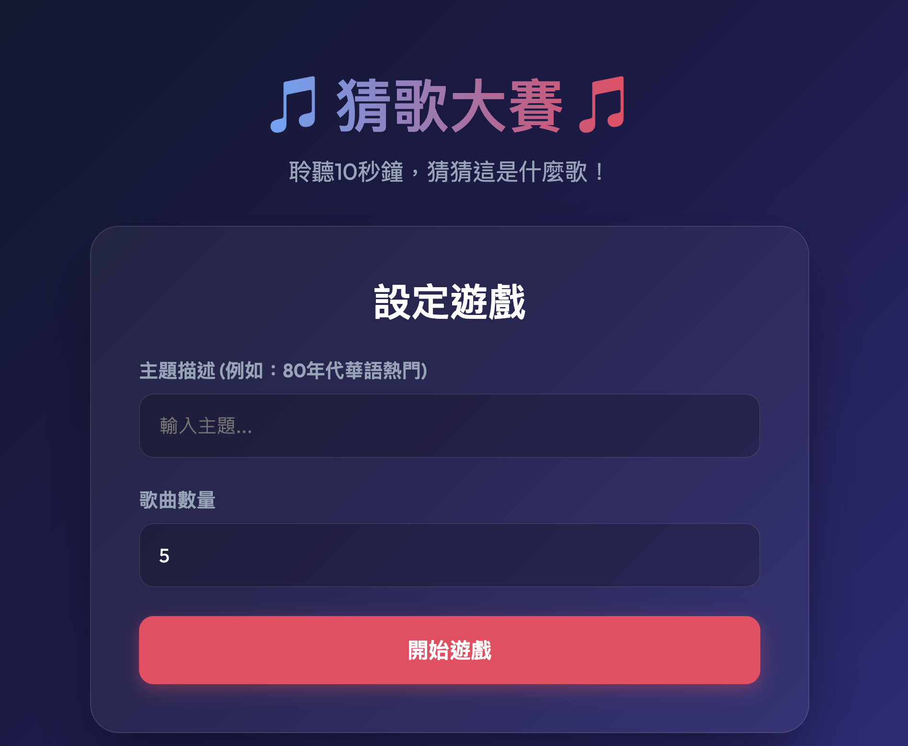

# Guess Song (AI 猜歌遊戲)

[線上玩](https://mros-guess-song.vercel.app/)

這是一個由 **Google Gemini** 選曲，並搭配 **iTunes** 免費 30 秒片段的猜歌遊戲。玩家可以輸入「想猜的主題（如：2000 年代華語經典、周杰倫、西洋老歌）」，AI 將生成專屬歌單。



## 本地端啟動

### 1. 下載專案並安裝依賴
```bash
git clone https://github.com/MROS/guess-song
cd guess-song
npm install
```

### 2. 設定環境變數
在專案根目錄建立一個 `.env.local` 檔案，並填入你的 Gemini API Key：
```env
# 從 https://ai.google.dev/ 取得你的免費金鑰
GEMINI_API_KEY="你的_GEMINI_API_KEY"
```

### 3. 啟動伺服器
```bash
npm run dev
```

打開 [http://localhost:3000](http://localhost:3000)，就可以開始挑戰猜歌了！
